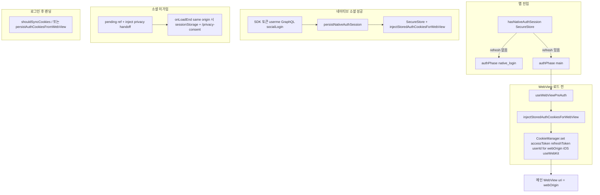

# React Native (Expo) ↔ Next.js (WebView) 인증·소셜 연동 명세

> **대상**: `overall-fe` 모노레포에서 `apps/native`(풀 WebView) 인증을 구현·유지보수하는 개발자  
> **목적**: 웹(`apps/web`)의 보안 모델(HttpOnly 세션·GraphQL 프록시)을 깨지 않으면서, 네이티브에서 세션 복구·소셜 로그인·미가입 회원가입 퍼널까지 **현재 웹 구현체와 동일한 계약**으로 맞춘다.

**관련 문서**

- 콜드 스타트·스플래시·부트 순서 디버깅(`[SplashBoot]` 로그, `extra.splashBootTimelineLog`·빌드 env로 릴리스 계측, 실기기 콘솔, 롤백): [`splash-boot-debug-maintenance-note.md`](./splash-boot-debug-maintenance-note.md)
- 웹 소셜 OAuth·`socialLogin`·스냅샷: [`apps/web/docs/social-login-provider-flow.md`](../../web/docs/social-login-provider-flow.md)
- 네이티브 로그인 셸 배경·히스토리: [`native-login-shell-and-auth-history.md`](./native-login-shell-and-auth-history.md)
- 브리지·UA·계약: [`.agents/skills/native-web-bridge/SKILL.md`](../../../.agents/skills/native-web-bridge/SKILL.md)

---

## 1. 원칙 (웹과의 관계)

| 구분 | 내용 |
|------|------|
| **웹 단일 진실** | 로그인 성공 후 앱 JWT는 여전히 **`POST /api/auth/set-session`** 으로 발급된 **HttpOnly 쿠키**가 표준이다. Relay·미들웨어·GraphQL 프록시는 기존과 동일. |
| **앱의 역할** | WebView는 동일 출처 쿠키 저장소를 쓴다. 앱은 (1) 쿠키를 **관측해 SecureStore에 미러링**, (2) 재실행 시 **SecureStore → CookieManager 주입**, (3) **네이티브 소셜 SDK**로 토큰을 받아 웹과 같은 GraphQL `socialLogin` 후 **동일 세션 정책**으로 저장한다. |
| **구버전 스펙 정정** | 과거 초안의 “웹 코드 수정 금지·postMessage 0”은 **현재 코드베이스와 불일치**다. 미가입 시 **`sessionStorage`에 소셜 스냅샷을 심는 것**은 브라우저 웹과 동일한 방식이며, 네이티브는 **`injectJavaScript`** 로 그 계약을 만족시킨다(아래 6절). 기능 브리지(카메라·크롬 UI 등)는 별도 계약으로 계속 사용한다. |

---

## 1-보. `webOrigin` (개발 서버 vs 배포)

메인 셸 WebView의 기준 origin은 `app/index.tsx` 에서 정한다.

| 빌드 | `webOrigin` (요약) | 비고 |
|------|-------------------|------|
| `__DEV__` (개발) | iOS: `http://localhost:3000` / Android: `http://10.0.2.2:3000` | `apps/web` dev 서버가 켜져 있어야 함. 실기기는 맥 IP로 바꾸는 편이 안전. |
| 릴리스·프로덕션 | `getWebAppOrigin()` | `expo-constants` 의 `expoConfig.extra.webOrigin` (없으면 `https://ovr-log.com`). `app.json` 의 `extra.webOrigin` 과 일치시킬 것. |

소셜 `fetch`·GraphQL·쿠키 주입·클리어 판별은 **모두 이 `webOrigin`과 동일한 origin** 을 전제로 동작한다.

---

## 1-보-2. 인증·쿠키 엔드투엔드 흐름 (요약도)



- **HttpOnly** 는 웹·WK가 설정한 쿠키를 `CookieManager.get` 으로 읽을 수 있을 때 `persistAuthCookiesFromWebView` 가 금고에 복제한다(경로: 홈 등).
- **앱이 직접 세션을 쓰는** 경로는 `persistNativeAuthSession` 이 `SecureStore` 쓰고 `injectStoredAuthCookiesForWebView` 로 **이름·도메인을 웹 쿠키와 맞춘** 대체 주입을 한다.

---

## 2. 필수 패키지 (앱)

```bash
pnpm add @react-native-cookies/cookies expo-secure-store
# 소셜(네이티브 SDK + Expo Auth Session) — 개발 빌드 필요
pnpm add @react-native-seoul/kakao-login @react-native-seoul/naver-login expo-auth-session
```

- 쿠키: `@react-native-cookies/cookies` (iOS는 `useWebKit`와 함께 사용, 구현은 `lib/nativeWebSession.ts` 참고)
- 금고: `expo-secure-store`, 키 이름은 아래와 동일하게 유지할 것

---

## 3. SecureStore 키 (웹 쿠키 이름과 대응)

`apps/native/lib/nativeWebSession.ts` 의 `SECURE_KEYS`:

| 키 | 의미 |
|----|------|
| `accessToken` | 앱용 JWT (HttpOnly 쿠키와 동일 이름으로 주입) |
| `refreshToken` | 리프레시 토큰 |
| `userId` | 사용자 ID (쿠키 `userId`) |

`hasNativeAuthSession()` 은 **refreshToken 존재 여부**로 판별한다.

---

## 4. 구현 단계 (실제 코드 매핑)

과거 스펙의 Step 1~3 개념은 유지하되, **구현 위치는 아래 파일을 단일 출처로 본다.**

### 4.1 쿠키 관측 → SecureStore (구 Step 1)

- **의도**: WebView가 로그인 랜딩에 도달했을 때 HttpOnly 쿠키를 네이티브에서 읽어 금고에 복사한다.
- **구현**: `persistAuthCookiesFromWebView(webOrigin)` (`lib/nativeWebSession.ts`)
- **호출 맥락**: 메인 WebView의 네비게이션·동기화 로직에서 “로그인 직후 랜딩”에 맞춰 호출할 수 있다. 전용 OAuth WebView만으로 로그인을 마치는 방식은 **현재 기본 경로가 아님**(아래 5절).

### 4.2 SecureStore → WebView 쿠키 주입 (구 Step 2)

- **의도**: 앱 재실행·쿠키 유실 시에도 동일 출처 요청에 세션이 붙도록 한다.
- **구현**: `injectStoredAuthCookiesForWebView(webOrigin)`, 훅 `useWebViewPreAuth(webOrigin)` (`hooks/useWebViewPreAuth.ts`)
- **CookieManager**: iOS는 `useWebKit: true` 로 **WKWebView** 쿠키 저장소와 맞춘다. `buildSetCookieFields` 로 `path: /`, `httpOnly: true`, HTTPS 이면 `secure: true`, `expires` 는 먼 미래.
- **연결**: `app/index.tsx` 에서 메인 WebView는 `isWebViewCookiePrepDone` 이 true일 때만 로드한다. Android 는 주입 후 `CookieManager.flush()`.

### 4.2-보. `persistNativeAuthSession` (소셜 뮤테이션 직후 한 번에)

`socialLogin` 성공 직후 `persistNativeAuthSession(webOrigin, { accessToken, refreshToken, userId })` 를 호출한다. 순서는 (1) `SecureStore` 에 토큰·userId 기록 (2) `injectStoredAuthCookiesForWebView` 동일. 웹 `set-session` 이 내려주는 쿠키와 **이름·의미**를 맞춘다.

GraphQL 응답 타입은 **`LoginResponseModel`** 이다. 앱용 JWT는 예전처럼 중첩 `tokens[]`에서 고르는 방식이 아니라, **응답 루트의 `accessToken`·`refreshToken`·`id`** 를 쓴다 (`apps/web` Relay `useSocialLoginMutation` 과 동일한 필드 선택·의미).

### 4.3 로그아웃·비로그인 랜딩 동기화 (구 Step 3)

- **의도**: **우리 웹 앱**에서 세션이 제거되었거나, 비로그인 랜딩으로 빠진 것으로 볼 수 있을 때 네이티브 금고를 비우고, 필요하면 로그인 셸(`native_login`)로 되돌린다.
- **클리어 저장소**: `clearNativeAuthStorage()` — `SECURE_KEYS` 전부 삭제.
- **셸으로 되돌리기**: `app/index.tsx` 의 `onNavigationStateChange` 에서 `setAuthPhase("native_login")`.
- **판별 함수**: `shouldClearNativeAuthFromNavigation(url, webAppOrigin)` — **필수 두 번째 인자**는 `webOrigin` 과 동일한 문자열.

**동일 origin(`url`의 origin === `new URL(webAppOrigin).origin`)일 때만** 경로를 본다. `nid.naver.com`, `kauth.kakao.com` 등 **외부 OAuth** URL 은 `false` 이다(아래 10절 “알려진 이슈” 참고). 조건(모두 **우리 origin** 기준 `pathname`):

| 조건(참이면 “클리어 후 셸 전환”) | 제외(항상 `false`로 한 번 더 막음) |
|--------------------------------|----------------------------------|
| `p.startsWith("/login")` | ` /login/social` |
| `p`에 `auth/logout` | ` /privacy-consent` |
| `p`에 `/api/auth/logout` | ` /social/…` (OAuth 콜백·후처리) |

`mainWebViewNavigationEffects` 에서는 같은 판별로 `clearNativeAuthStorage()` 만 호출하고(셸 phase 는 index 쪽), URL 동기화와 함께 쓰인다.

### 4.4 `shouldSyncCookiesFromWebView` (홈 랜딩 시 금고 미러)

- **구현**: `p === "/"` 또는 `p.startsWith("/home")` **이고** origin이 `webOrigin` 과 같을 때 `persistAuthCookiesFromWebView` (WebView 쿠키 → SecureStore) 시도.
- `handleMainAppWebViewNavigationStateChange` 에서 호출.

### 4.5 `onLoadEnd` 와 미가입 핸드오프 (메인 WebView)

- `isSameWebAppOrigin(url, webOrigin)` 이 **true**일 때만 (1) 첫 로드 완료 플래그 (2) 뷰포트 주입 (3) `pendingPrivacyHandoffRef` 가 있으면 `injectJavaScript` 로 `sessionStorage` + `/privacy-consent` 전환.
- `nid.naver.com` 처럼 **다른 origin** 은 `sameOrigin === false` 가 정상이며, 이 단계에서는 **아무것도 주입하지 않는다**. 콜백이 `https://{webApp}/social/.../callback` 으로 돌아온 뒤에 `true` 가 된다.

### 4.6 딥링크 → WebView (카카오 등 앱 복귀)

`Linking` URL 수신 시 `injectJavaScript` 로 `postMessage` 를 쓰되, `window.ReactNativeWebView` **가드** 후 호출(브리지 주입 전 타이밍 이슈 방지). IIFE 끝에 `true` (WK 권장).

### 4.7 토큰 갱신 / 401 Self-Healing (구 Step 4, 선택)

- **의도**: 웹이 리프레시로 쿠키만 갱신하고 네이티브 금고가 낡은 경우를 줄인다.
- **상태**: **선택 과제**. 네이티브 단독 API 호출이 늘어날 때 CookieManager 재조회·금고 갱신 패턴을 검토한다. 현재 메인 경로는 WebView 내 웹 요청이 대부분이다.

---

## 5. 네이티브 소셜 로그인 (웹 `social-login-provider-flow.md` 와 정합)

브라우저는 OAuth **authorization code**를 쓰고, 네이티브는 **SDK 액세스 토큰**을 직접 받는다. 이후 단계는 웹과 동일한 **프로필(이메일)·`socialLogin` 뮤테이션·세션 쿠키**로 맞춘다.

| 단계 | 웹 | 앱 (현 구현) |
|------|----|----------------|
| 프로바이더 토큰 | 코드 교환 후 access token | 카카오·네이버 SDK / 구글 `expo-auth-session/providers/google` |
| 프로필 JSON | 서버·라우트에서 조회 | `POST /api/auth/kakao|naver/userme` (`accessToken`), 구글은 OIDC UserInfo |
| 앱 로그인 | Relay `socialLogin` + `set-session` | `POST {webOrigin}/api/graphql` 동일 뮤테이션 → `persistNativeAuthSession` |
| 세션 | HttpOnly 쿠키 | SecureStore + `injectStoredAuthCookiesForWebView` 와 동일 쿠키 이름 |

뮤테이션 성공 페이로드는 **`LoginResponseModel`** (`accessToken`·`refreshToken`·`id` 등 루트 스칼라). 웹·앱 모두 이 필드로 세션을 잡는다.

**코드 위치**

- 오케스트레이션: `hooks/useNativeSocialLogin.ts`
- GraphQL·미가입 스크립트: `lib/social/completeNativeSocialLogin.ts`
- 설정: `app.json` → `extra.nativeSocialLogin`, 플러그인 `@react-native-seoul/kakao-login`, `@react-native-seoul/naver-login`

**빌드**: 네이티브 모듈 사용으로 **Expo Go가 아닌 development build / `expo run:ios|android`** 가 필요하다.

---

## 6. 회원가입·lockedFields (소셜 미가입 / 추가 정보)

웹에서는 소셜 콜백이 `sessionStorage` 키 `overall_social_oauth_snapshot` 에 `{ provider, accessToken, email, userMe, savedAt }` 를 넣고, 미가입 시 `/privacy-consent` → 온보딩에서 **`mapSocialSnapshotToRegisterPrefill`** 으로 **prefill + `lockedFields`** 를 만든다 (`OnboardingEntryClient.tsx`).

**앱에서도 동일하면 된다.** 즉, 온보딩에 들어갈 때 웹이 읽는 저장소에 같은 JSON이 있으면 **lockedFields는 자동**이며, **별도 브리지 메시지로 필드명을 넘길 필요가 없다.**

### 6.1 현재 방식 (권장, 브리지 불필요)

- 미가입 시 네이티브는 `buildPrivacyConsentHandoffScript` 로 **같은 키·같은 스냅샷 형태**를 `sessionStorage`에 쓰고 `location.replace("/privacy-consent")` 한다.
- 사용자가 동의 후 온보딩으로 이동하면 **웹 클라이언트만** `readSocialSnapshotFromSessionStorage` → `mapSocialSnapshotToRegisterPrefill` 을 실행해 locked UI가 채워진다.

### 6.2 브리지로 할 수 있나?

- **가능은 함**: 웹에 `postMessage` 핸들러를 추가해 스냅샷 JSON을 받아 `sessionStorage.setItem` 하도록 할 수 있다. 다만 **웹 코드 변경·계약 중복**이 생기고, 지금은 **inject 한 번으로 웹 OAuth 경로와 완전히 동일**하므로 권장하지 않는다.
- **브리지가 유리한 경우**: IT 정책으로 서드파티 스토리지가 막히거나, inject 타이밍이 불안정해 **명시적 요청/응답**이 필요할 때만 검토한다. 그때는 `BridgeMessage` 타입과 `useBridge` 계약을 스킬 문서대로 양쪽에 추가한다.

---

## 7. 앱 진입 분기 (`app/index.tsx` 요약)

| `authPhase` | 의미 |
|-------------|------|
| `checking` | 앱 기동 직후: `hasNativeAuthSession()` 으로 refreshToken 유무 판단 |
| `native_login` | `NativeSocialLoginScreen` (카카오·네이버·구글 네이티브/Expo) |
| `main` | 메인 WebView: **`authPhase === "main"` 이고 `isWebViewCookiePrepDone`** 일 때만 마운트(`useWebViewPreAuth` 가 `injectStoredAuthCookiesForWebView` 끝낸 뒤) |

- **소셜 성공(`ok`)**: `onSessionReady` → `main` — 이미 `persistNativeAuthSession` 으로 금고·쿠키 반영.
- **소셜 미가입(`not_registered`)**: `onNeedsPrivacyConsent` 가 `buildPrivacyConsentHandoffScript` 를 ref에 넣고 `main` — WebView 첫 **같은 origin** `onLoadEnd`에서 주입(위 4.5절).
- **스플래시**: `authPhase` 가 `main` 이어도 WebView **첫 로드 전**에는 `splashContentReady` 조건에 걸려 커스텀 스플래시가 잠시 유지될 수 있다.

`FORCE_NATIVE_LOGIN_UI_PREVIEW` 가 true이면 UI 테스트용으로 로그인 전용 화면만 고정할 수 있다.

---

## 8. UA·브리지 (인증 외)

- WebView UA 접미사 `Overall_RN`, `window.isNativeApp` 주입은 기존과 동일.
- 인증 세션 식별용 **전용 쿠키는 없다** (일반 HttpOnly 세션 쿠키).

---

## 9. 체크리스트 (구현·리뷰 시)

- [ ] `webOrigin` 이 개발/스테이징/프로덕션과 일치하는가 (`lib/webAuthConfig.ts`, `app.json` extra)
- [ ] 소셜 콘솔(카카오·네이버·구글)에 네이티브 리디렉션·패키지명·키가 등록되었는가
- [ ] 미가입 플로우에서 **스냅샷 키·필드가 웹 `SocialOauthSnapshot` 과 동일**한가 (`lib/social/nativeSocialTypes.ts` 주석 참고)
- [ ] 로그아웃 시 네이티브 금고·WebView 쿠키가 함께 정리되는가
- [ ] `shouldClearNativeAuthFromNavigation(url, webOrigin)` **두 인자** 호출 여부(외부 OAuth 오탐 방지)
- [ ] iOS: `@react-native-seoul/kakao-login` prebuild 시 `Info.plist` 의 `KAKAO_APP_KEY`·URL scheme (`kakao{네이티브앱키}`)

---

## 10. 알려진 이슈·해결 (유지보수 이력)

1. **`/login/social` 에서 `native_login`으로 튕김 (미가입 핸드오프 끊김)**  
   - 원인: `shouldClearNativeAuth` 가 `p.startsWith("/login")` 만 볼 때, **`/login/social`** 이 걸렸다.  
   - 대응: ` /login/social` 제외 + (아래) origin 제한.

2. **`nid.naver.com` OAuth 중 `native_login`으로 튕김**  
   - 원인: 경로 ` /login/noauth/…` 가 **`/login` prefix**로 오탐. Naver 쪽은 **다른 host**이지만 예전엔 host 없이 `pathname` 만 보는 버그가 있을 수 있음.  
   - 대응: `shouldClearNativeAuthFromNavigation` 은 **반드시** `u.origin === new URL(webAppOrigin).origin` 인 경우에만 위 표를 적용. 외부 OAuth 페이지는 **항상 false**.

3. **`/social/…/callback` 등**  
   - ` /social/` prefix 는 클리어 대상에서 제외(콜백·리다이렉트 사이 `native_login` 방지).

4. **WebView `onLoadEnd` + `sameOrigin=false`** (네이버·카카오 호스트)  
   - 정상. 핸드오프는 **콜백이 `webOrigin`으로 돌아온 뒤** `true` 가 될 때 처리.

5. **Metro 로그: `[NativeSocial]` 등**  
   - `__DEV__` 전용. 릴리스에서 제거·슬림화할지 정책에 따른다.

6. **웹 OAuth 콜백 후 홈에서 뒤로가기 → 콜백 URL**  
   - 원인: 웹 [`SocialCallbackAutoLogin`](../../web/app/social/[provider]/callback/SocialCallbackAutoLogin.tsx) 성공 시 과거 `location.href = "/"` 는 히스토리에 콜백을 남김.  
   - 대응: 성공 홈 이동은 **`window.location.replace("/")`** 로 콜백 엔트리를 치환(웹 [`social-login-provider-flow.md`](../../web/docs/social-login-provider-flow.md) ⑦). 네이티브 SDK 전용 로그인은 이 콜백 페이지를 로드하지 않으므로, 동일 증상이면 **WebView 내 웹 소셜 버튼 플로우**인지 원격 디버깅으로 URL 스택을 확인.

7. **로컬 WebView 첫 `/` 직후 `clear-session` → `/login/social`**  
   - 원인: 과거 `__DEV__` 에 메인 WebView `source` 에 `buildDevCookieHeader()` 를 붙이면, [`devWebViewCookies.ts`](../../native/lib/devWebViewCookies.ts) 의 **고정·만료 가능 토큰**이 요청에 실려 Next [`proxy.ts`](../../web/proxy.ts) 가 비로그인으로 판단.  
   - 대응: 메인 셸 WebView는 **`injectStoredAuthCookiesForWebView` 주입만** 사용하고, dev용 하드코딩 Cookie 헤더는 붙이지 않음 (`app/index.tsx`).

---

*이전 버전의 “웹 수정 금지·postMessage 금지” 문구는 폐기했다. 현재 저장소 기준으로 위 경로와 웹 문서를 우선한다.*
