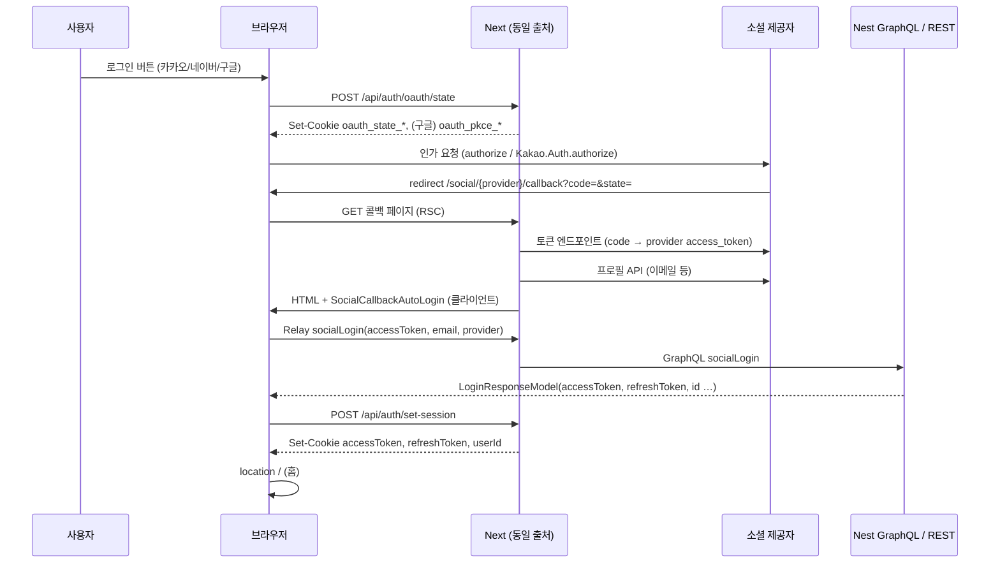
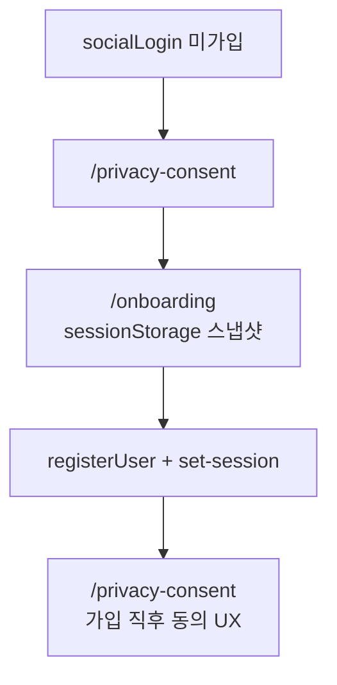

# 회원가입·로그인·OAuth 2.0 플로우 (웹 `apps/web`)

이 문서는 **Overall 웹 앱**에서 소셜 로그인·회원가입까지 이어지는 경로를 **OAuth 2.0 관점**과 함께 설명합니다.  
백엔드(Nest.js, AWS EC2)와 프론트(Next.js, Vercel)가 **물리적으로 분리**되어 있다는 전제에서, 브라우저가 외부와 주고받는 것은 **각 소셜 제공자(카카오·네이버·구글)** 와 **동일 출처의 Next 앱**(`/api/*`, `/login/social`, `/social/.../callback` 등)뿐입니다.

**제공자별 HTTP 엔드포인트·프로필 필드 매핑 표**는 [`social-login-provider-flow.md`](./social-login-provider-flow.md) §6을 함께 보세요.

---

## 1. OAuth 2.0 기본 개념과 우리 앱에서의 역할

### 1.1 Authorization Code Grant

Overall 웹은 **OAuth 2.0 Authorization Code** 흐름을 사용합니다.

| 요소 | 설명 |
|------|------|
| **리소스 소유자** | 로그인하는 사용자 |
| **클라이언트** | Overall 웹(브라우저 + Next 서버가 분담) |
| **인가 서버** | 카카오·네이버·구글 로그인 / 동의 화면을 제공하는 엔드포인트 |
| **토큰 엔드포인트** | 인가 코드(`code`)를 **앱이 사용할 액세스 토큰**으로 바꾸는 서버 API |
| **리소스 서버(프로필)** | 사용자 정보(`userMe`, 이메일 등)를 주는 API — 제공자마다 URL이 다름 |

사용자가 동의하면 **브라우저가 인가 서버로부터 `redirect_uri`로 리다이렉트**되며, 쿼리에 **`code`(일회용 인가 코드)** 가 붙습니다.  
**클라이언트 시크릿·REST 키로 토큰을 바꾸는 요청**은 브라우저에 노출하지 않고 **Next 서버(RSC·Route Handler 경유)** 에서 수행합니다.

### 1.2 `redirect_uri` 등록

각 제공자 개발자 콘솔에 **정확한 콜백 URL**을 등록해야 합니다. 예:

- `{배포 Origin}/social/kakao/callback`
- `{배포 Origin}/social/naver/callback`
- `{배포 Origin}/social/google/callback`

로컬/Vercel 등 **Origin이 바뀌면 각각 등록**이 필요합니다.

### 1.3 `state` — CSRF 완화

OAuth 표준 권장 패턴으로, 인가 요청 전에 **예측 불가능한 `state`** 를 만들고, 콜백에서 돌아온 `state`와 **일치하는지** 검증합니다.

Overall에서는 로그인 버튼 클릭 시:

1. 브라우저가 `POST /api/auth/oauth/state`로 `{ provider, state }` 전송  
2. 서버가 **`oauth_state_{provider}`** 이름의 **httpOnly·SameSite=Lax** 쿠키에 저장 (유효 시간 예: 10분)  
3. 사용자가 콜백 URL로 돌아오면 **RSC 쿠키 값과 쿼리 `state`** 를 비교  

불일치 시 `/login/social?socialErr=state_mismatch` 등으로 보내고, 로그인 화면에서 토스트로 안내합니다.

### 1.4 PKCE (Proof Key for Code Exchange) — 구글

**공개 클라이언트**(브라우저 앱)에서 Authorization Code를 안전하게 쓰기 위한 **RFC 7636** 확장입니다.

1. 클라이언트가 **코드 베리파이어**(`code_verifier`)를 무작위 생성  
2. 그 해시를 **코드 챌린지**(`code_challenge`, S256)로 만들어 인가 URL에 포함  
3. 토큰 교환 시 **`code_verifier` 원문**을 함께 보냄  

Overall에서는 `code_verifier`를 **`oauth_pkce_google` httpOnly 쿠키**에 저장하고, 콜백 **서버**가 토큰 요청 시 사용합니다.

---

## 2. 로그인 성공 플로우 (이미 가입된 사용자)

아래는 **소셜 계정이 이미 백엔드에 연동·가입된 경우**입니다.

### 2.1 단계별 요약

| 단계 | 위치 | 내용 |
|------|------|------|
| 로그인 UI | `/login/social` | `KakaoLoginButton` / `NaverLoginButton` / `GoogleLoginButton` — `useOAuthRedirectUri`로 하이드레이션 안전한 `redirect_uri`, `useSocialOAuthStart`·`postOAuthState`로 state 저장 후 제공자로 이동 |
| state 저장 | `POST /api/auth/oauth/state` | 쿠키 `oauth_state_{kakao|naver|google}`, 구글은 추가로 `oauth_pkce_google` |
| 콜백 (교환) | `app/social/[provider]/callback/page.tsx` (RSC) | `state`/PKCE 검증 → `exchange*CodeForUserMe`로 **provider access token** + **userMe** 획득 |
| 자동 로그인 | `SocialCallbackAutoLogin.tsx` | 스냅샷을 `sessionStorage`에 저장 후 **`socialLogin` 뮤테이션** 자동 실행 |
| 앱 세션 | `POST /api/auth/set-session` | 응답 JWT를 **httpOnly** `accessToken`, `refreshToken`, `userId` 쿠키로 저장 (`lib/auth/applySessionFromTokens.ts`) |
| 스냅샷 정리 | 성공 시 | 로그인 성공 후 `overall_social_oauth_snapshot` 삭제 |

---

## 3. 미가입(회원가입) 플로우

소셜 **`socialLogin`이 “미가입”으로 실패**하면, 약관 동의를 거친 뒤 온보딩으로 보냅니다.

### 3.1 단계별 요약

| 단계 | 설명 |
|------|------|
| 스냅샷 | `socialLogin` **직전**에 이미 `sessionStorage`에 스냅샷 저장됨 (`SocialCallbackAutoLogin`). 미가입 시에도 **삭제하지 않음** |
| 미가입 분기 | `isSocialLoginNotRegisteredError` 등으로 판별 후 **`window.location.replace("/privacy-consent")`** |
| 동의 화면 | `privacy-consent`는 비로그인 접근 허용을 위해 **`PUBLIC_ROUTES`** 에 포함 (`lib/routes.ts`) |
| 온보딩 | 동의 후 **`router.push("/onboarding")`** (`PrivacyConsentClient`) |
| 프리필·잠금 | `OnboardingEntryClient`가 `readSocialSnapshotFromSessionStorage` → `mapSocialSnapshotToRegisterPrefill`로 **`initialSocialPrefill` + `lockedFields`** — **동의만 거친 경우와 직전 스펙 동일** |
| 회원가입 완료 | `registerUser` 성공 시 세션 쿠키 설정 후 **`/privacy-consent`** 로 이동하는 경로가 있음 (`AdditionalInfoCollect`) — 제품 정책에 따른 가입 직후 동의 UX |

---

## 4. 세션·쿠키·저장소 정리

### 4.1 앱 세션 (로그인 후)

| 이름 | 용도 | 설정 경로 |
|------|------|-----------|
| `accessToken` | API·GraphQL 프록시 인증 | `POST /api/auth/set-session`, `proxy.ts` 선제 갱신 등 |
| `refreshToken` | 액세스 갱신 | 동일 |
| `userId` | 사용자 식별 | 동일 |

정책 예: httpOnly, SameSite=Lax, 경로 `/`, 프로덕션에서 Secure — 레거시 [`app/social/callback/route.ts`](../app/social/callback/route.ts) 쿼리 리다이렉트와 같은 쿠키 의미를 맞춥니다.

### 4.2 OAuth 진행용 쿠키 (로그인 세션과 별개)

| 이름 패턴 | 용도 |
|-----------|------|
| `oauth_state_{provider}` | CSRF용 state |
| `oauth_pkce_google` | PKCE code_verifier |

### 4.3 `sessionStorage` 스냅샷

| 키 | 내용 | 삭제 시점 |
|----|------|-----------|
| `overall_social_oauth_snapshot` (`SOCIAL_OAUTH_SNAPSHOT_STORAGE_KEY`) | `provider`, 소셜 **provider access token**, `email`, `userMe`, `savedAt` | **소셜 로그인 성공** 후 세션 저장 직후 / **registerUser 성공** 후 등 플로우 종료 시 |

---

## 5. 오류 처리

### 5.1 콜백(RSC)에서 교환·검증 실패

`page.tsx`에서 실패 시 **`redirect("/login/social?socialErr=...")`** 로 통일합니다.

클라이언트 [`SocialOAuthCallbackToast`](../app/login/social/SocialOAuthCallbackToast.tsx)가 `socialErr` 코드별로 토스트 후 URL에서 쿼리 제거합니다.

| `socialErr` | 의미 |
|---------------|------|
| `unsupported_provider` | 지원하지 않는 경로의 provider |
| `oauth_provider` | 제공자가 `error` 쿼리로 거부 등 |
| `missing_code` | 인가 코드 없음 |
| `missing_host` | Host로 redirect_uri 구성 불가 |
| `missing_state` | state 없음 |
| `state_mismatch` | 쿠키와 state 불일치 |
| `missing_pkce` | 구글 PKCE 쿠키 없음 |
| `exchange_failed` | 토큰·프로필 HTTP 교환 실패 (`safeFetchJson` 등) |

### 5.2 외부 HTTPS `fetch failed`

서버에서 카카오 API 등 호출 시 네트워크 레벨 예외는 [`lib/social/safeFetchJson.ts`](../lib/social/safeFetchJson.ts)로 삼켜 RSC 전체 크래시를 막고, 위와 같이 로그인 화면으로 보냅니다.

---

## 6. 프록시·라우팅

- [`proxy.ts`](../proxy.ts): `PUBLIC_ROUTES`에 없으면 **비로그인 시** 세션 클리어 후 로그인 유도 등  
- [`lib/routes.ts`](../lib/routes.ts): `/login/social`, `/social/*/callback`, `/onboarding`, `/privacy-consent` 등 **비로그인 소셜·가입 동선** 허용

---

## 7. GraphQL 계약 (요약)

| 뮤테이션 | 입력 | 성공 | 미가입 |
|----------|------|------|--------|
| `socialLogin` | 소셜에서 받은 `accessToken`, 프로필에서 뽑은 `email`, `provider` enum | 앱 JWT + 사용자 정보 | 예외(메시지 휴리스틱으로 미가입 판별) |
| `registerUser` | `RegisterUserInput` + 프로필 이미지 업로드 | 앱 JWT 등 | — |

미가입 메시지 판별: [`lib/social/isSocialLoginNotRegisteredError.ts`](../lib/social/isSocialLoginNotRegisteredError.ts).

---

## 8. 클라이언트 공통 모듈 (참고)

| 모듈 | 역할 |
|------|------|
| `lib/social/oauthStateClient.ts` | `createOAuthState`, `POST` state |
| `hooks/useSocialOAuthStart.tsx` | 버튼 로딩·실패 토스트 |
| `hooks/useOAuthRedirectUri.tsx` | SSR/CSR 일치하는 `redirect_uri` |
| `lib/onboarding/socialRegisterHelpers.ts` | 소셜 모드 `registerUser` 입력 조립 |

---

## 9. 관련 문서·파일

| 문서 / 경로 |
|-------------|
| 제공자별 상세·프리필 필드 표: [`social-login-provider-flow.md`](./social-login-provider-flow.md) |
| 앱 라우트 공개 범위: [`lib/routes.ts`](../lib/routes.ts) |
| 세션 POST: [`app/api/auth/set-session/route.ts`](../app/api/auth/set-session/route.ts) |
| OAuth state 쿠키: [`app/api/auth/oauth/state/route.ts`](../app/api/auth/oauth/state/route.ts) |
| 레거시 쿼리 토큰 리다이렉트: [`app/social/callback/route.ts`](../app/social/callback/route.ts) |

---

## 10. 변경 이력 메모

- 소셜 콜백에서 **수동 버튼 없이** `socialLogin` 자동 호출  
- 미가입 시 **`/privacy-consent` 선행** 후 `/onboarding`  
- 콜백 단계 오류는 **로그인 화면 토스트** (`socialErr`)로 통일  

### 2026-05-04 — 소셜 OAuth 콜백 히스토리·뒤로가기 정리

**기획·정책**

- **목표**: 소셜 OAuth 웹 콜백 성공 직후 `window.location.href = "/"` 사용으로 히스토리에 `/social/.../callback` 이 남아, 홈에서 뒤로가기 시 빈 콜백 페이지·레이아웃 이슈·일회용 `code` 재노출 위험이 생기는 문제를 제거함.
- **제약**: Relay·GraphQL 스키마·필드 선택 변경 없음(프론트 내비게이션·문서만).

**구현 매핑**

| 구분 | 내용 |
|------|------|
| 웹 콜백 | `SocialCallbackAutoLogin.tsx` — 로그인 성공 후 홈 이동을 **`window.location.replace("/")`** 로 통일(기존 `href` 대체). 동일 파일 내 오류·분기에서 이미 쓰던 `replace` 패턴과 정렬. |
| 웹 플로우 문서 | `social-login-provider-flow.md` — ⑦단계에 **`replace` 정책** 명시, 웹 OAuth(브라우저·WebView)와 네이티브 SDK 경로를 표로 구분. |
| 네이티브 스펙 | `RNWebView_Auth_Implementation_Spec.md` §10 — **항목 6**: 원인·대응·디버깅 힌트(콜백 URL 스택 vs SDK 등). |

**의사결정·트레이드오프**

- Next `useRouter().replace` 대신 **`window.location.replace` 유지** — httpOnly 쿠키 반영 후 **풀 페이지 리로드** 전제와 맞고, 같은 파일의 다른 분기(`replace("/login/social")`, `replace("/privacy-consent")` 등)와 **일관된 API**를 유지함.

**검증**

- **수동**: 웹·WebView에서 로그인 후 홈에서 뒤로가기 시 콜백 URL로 **복귀하지 않음**, iOS **가장자리 백 제스처** 포함.
- **데이터 계약**: Relay·GraphQL 필드 변경 없음.

**잔여 리스크·메모**

- 네이티브 **SDK 전용** 소셜 로그인은 해당 웹 콜백 페이지를 로드하지 않을 수 있어, 동일 증상이면 **WebView 내 웹 소셜 버튼 플로우**인지 등 경로를 구분해 확인하는 것이 문서·디버깅 가이드와 합치함.

이 문서는 위 동선을 기준으로 작성되었습니다.
